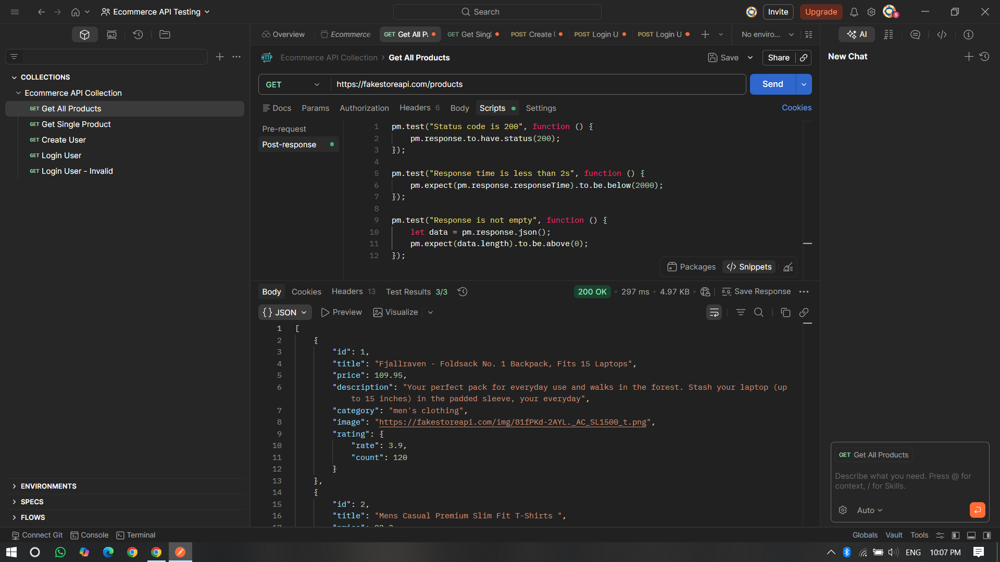
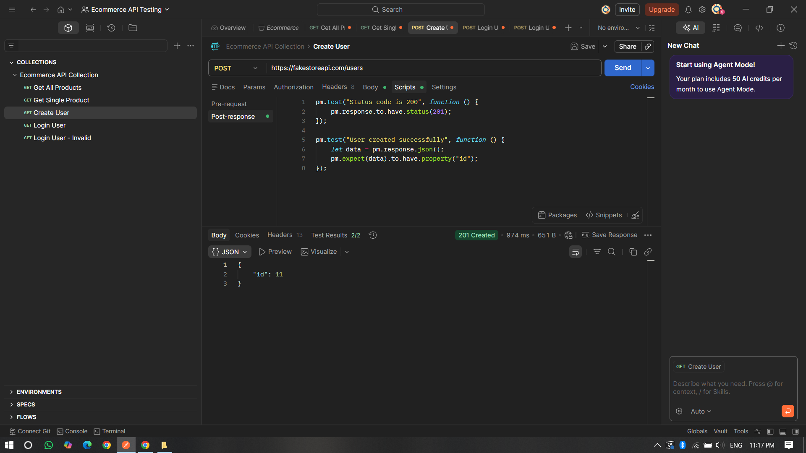
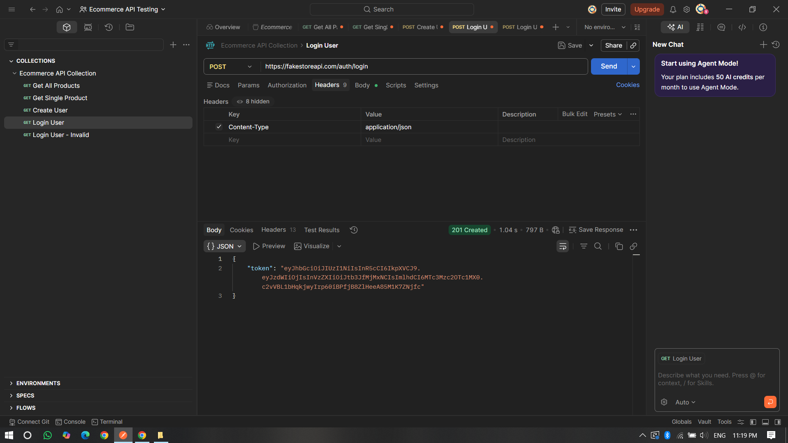
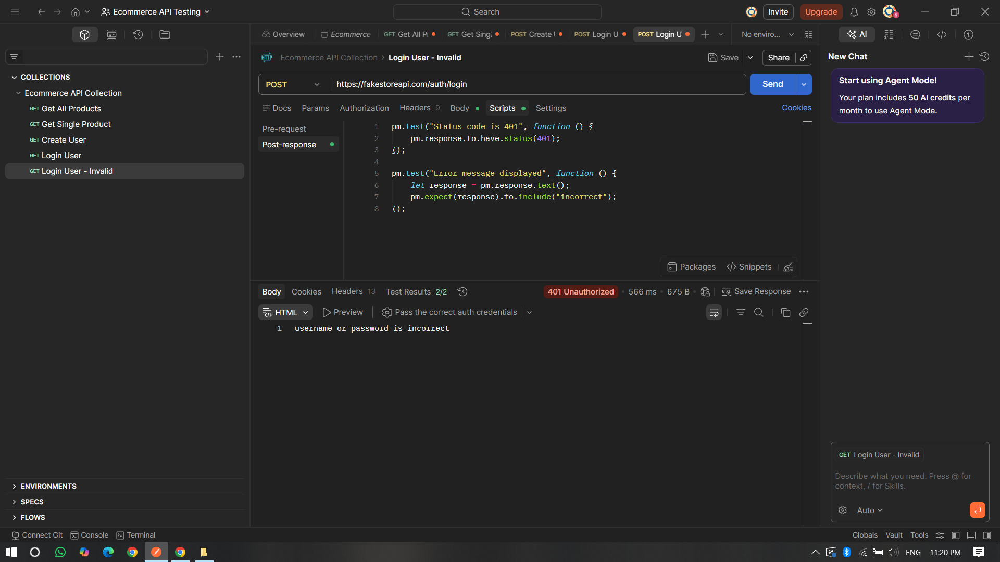

# 🛒 Ecommerce API Testing Project (Postman)

## 📌 Project Overview

This project demonstrates API testing of an E-commerce application using Postman.

It covers:

* Functional testing
* Positive testing
* Negative testing
* Response validation
* Status code validation

---

## 🧰 Tools Used

* Postman
* FakeStore API (https://fakestoreapi.com)

---

## 📂 Project Structure

* `collection.json` → Postman Collection
* `Screenshots/` → Test execution proof
* `README.md` → Project documentation

---

## 🚀 APIs Tested

### 1️⃣ Get All Products

* Method: GET
* Endpoint: `/products`
* Validations:

  * Status code = 200
  * Response time < 2 seconds
  * Response is not empty

---

### 2️⃣ Get Single Product

* Method: GET
* Endpoint: `/products/1`
* Validations:

  * Status code = 200
  * Product contains title

---

### 3️⃣ Create User

* Method: POST
* Endpoint: `/users`
* Validations:

  * Status code = 201
  * User ID is generated

---

### 4️⃣ Login User (Positive)

* Method: POST
* Endpoint: `/auth/login`
* Validations:

  * Status code = 200
  * Token is received

---

### 5️⃣ Login User (Negative Testing)

* Method: POST
* Endpoint: `/auth/login`
* Invalid credentials used
* Validations:

  * Status code = 401
  * Error message displayed

---

## 📸 Screenshots

### ✅ Get Products

### ✅ Create User

### ✅ Login Success

### ❌ Login Failed (Negative Testing)

---

## 🎯 Key Learnings

* API request & response validation
* Writing test scripts in Postman
* Handling positive and negative scenarios
* Understanding HTTP status codes

---

## 💼 Author

Suyash Pathak
Aspiring QA / SDET Engineer
